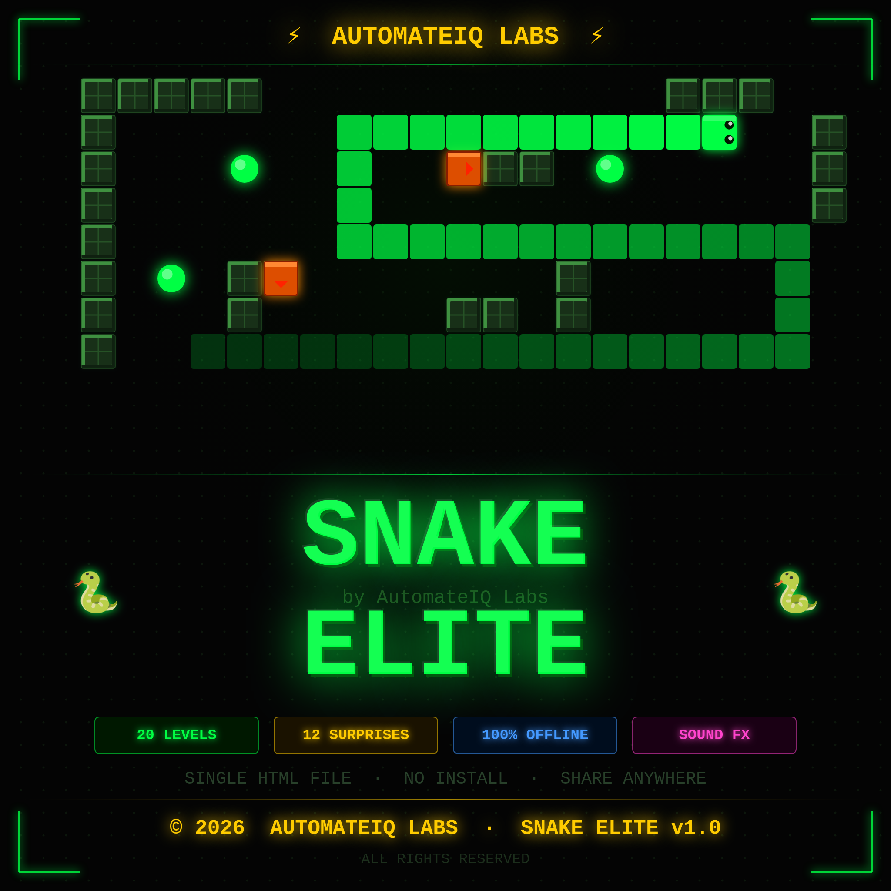

<div align="center">

# 🐍 Snake Elite

**by [AutomateIQ Labs](https://github.com/automateiqLabs)**

[](https://developer.mozilla.org/en-US/docs/Web/JavaScript)
[](https://developer.mozilla.org/en-US/docs/Web/API/Canvas_API)
[]()
[]()
[]()

> A fully offline, single-file retro Snake game — rebuilt from scratch with 20 levels,
> 12 randomized surprise events, and a procedural sound engine.
> No install. No internet. No frameworks. Just open and play.



</div>

---

## 📌 What is Snake Elite?

Snake Elite is a modern take on the classic Nokia Snake game — built entirely inside
**one `.html` file** using nothing but vanilla JavaScript, HTML5 Canvas, and Web Audio API.

No dependencies. No frameworks. No build tools.

You can share it over WhatsApp, USB, or email —
open it in any browser and it works instantly.

---

## ✨ Features

| Feature | Details |
|---|---|
| 🎮 **20 Progressive Levels** | Unique obstacle layouts, increasing speed, real difficulty scaling |
| 💥 **12 Surprise Events** | Blackout, Reverse Controls, Ghost Food, Portals, Fog of War, Magnetic Food — randomized every session |
| 🔊 **Procedural Sound System** | 100% Web Audio API — zero audio files, all effects synthesized in real time |
| ❤️ **3 Lives System** | Die → restart current level with score preserved |
| ⚡ **Dynamic Speed Ramping** | Every 4 food eaten → +7ms faster (minimum cap: 55ms) |
| 🤖 **Moving Obstacles** | AI-driven blockers that increase in count each level |
| 🌀 **Wall Wrap** | Nokia-style — pass through walls, emerge the other side |
| 🔒 **PIN Gate** | Hardcoded 4-digit access control, required every session |
| 🏆 **Persistent High Score** | Saved via localStorage across all sessions |
| ✨ **Particle FX** | Physics-based burst particles on food eat and death |
| ⏸️ **Pause System** | Spacebar or button — full game state preserved |
| 📦 **Offline & Portable** | Single `.html` file — runs in Edge, Chrome, Brave without internet |

---

## 📁 Repository Structure
snake-elite/
├── snake_elite.html          ← Entire game (fully self-contained)
├── SnakeElite.vbs            ← Optional: desktop launcher for Windows
├── snake_elite_poster.png    ← Game poster / banner
└── README.md

---

## 📥 Download & Play

| File | Description | Download |
|---|---|---|
| `snake_elite.html` | Main game file — entire game inside | [⬇️ Download](https://github.com/YOUR_USERNAME/snake-elite/raw/main/snake_elite.html) |
| `SnakeElite.vbs` | Windows desktop launcher (optional) | [⬇️ Download](https://github.com/YOUR_USERNAME/snake-elite/raw/main/SnakeElite.vbs) |

> 💡 **Quick start:** Just download `snake_elite.html` → open in Chrome → Enter PIN `1147` → Play

---

## ▶️ How to Run

### ✅ Method 1 — Run in Browser (Easiest)

> Works on Windows, Mac, Linux — no install needed.

Download snake_elite.html from this repo
Open the file in Chrome, Edge, or Brave
Enter PIN: 1147
Play


> ⚠️ **Note:** Firefox may block some Web Audio API features locally.
> Chrome or Edge recommended for best experience.

---

### ✅ Method 2 — Run as Desktop App (Windows — No Browser UI)

> Launches the game directly as a standalone window — feels like a real installed app.

**Step 1:** Download both files into the same folder:
snake_elite.html
SnakeElite.vbs

**Step 2:** Double-click `SnakeElite.vbs`

The game opens in a clean browser window — no tabs, no address bar.

---

### ✅ Method 3 — Share & Play Anywhere (Offline)
Send snake_elite.html via:
→ USB drive
→ WhatsApp (as a document)
→ Email attachment
→ Google Drive / any cloud link
Receiver opens the file in any browser → Enter PIN → Play instantly.
No internet required on their end.

---

## 🛠️ Tech Stack

| Layer | Technology |
|---|---|
| **Rendering** | HTML5 Canvas API (2D context) |
| **Audio** | Web Audio API (OscillatorNode + GainNode synthesis) |
| **Logic** | Vanilla JavaScript — zero frameworks |
| **Storage** | localStorage (high score persistence) |
| **Styling** | Pure CSS3 |
| **Packaging** | Single `.html` file — self-contained |

---

## ⚙️ Configuration

Want to customize the game? Open `snake_elite.html` in any text editor and edit these values:

```javascript
// 🔒 Change game PIN
const GAME_PIN = '1147';

// 📐 Change grid dimensions
const GW = 30, GH = 24;

// 🎮 Level configs — edit LV[] array
// 💥 Surprise event pool — edit SP[] array
```

---

## 🎮 Controls

| Key | Action |
|---|---|
| `Arrow Keys` | Move snake |
| `Spacebar` | Pause / Resume |
| `Enter` | Confirm / Start |

---

## 📸 Preview

> Game running in browser — Level 5 with active Portal surprise event.


---

## 📄 License

Built and owned by **AutomateIQ Labs**.
Free to play and share. Not for resale or rebranding.

---

<div align="center">

**Made with 💚 by [Muhammad Antor](https://github.com/automateiqLabs) — AutomateIQ Labs**

*If you enjoyed it, drop a ⭐ — it means a lot.*

</div>
